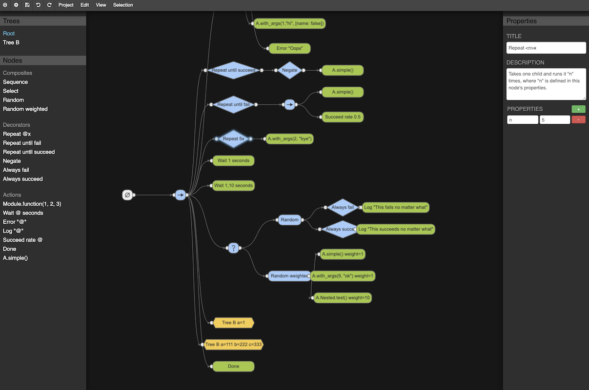

# Behavior Tree Editor

This tool has been adapbed for the [Bot Testing
Framework](https://git.corp.adobe.com/pages/BotTestingFramework/bot_army/readme.html)
based on the existing [Behavior3
Editor](https://github.com/behavior3/behavior3editor/)

> See the [Releases tab](https://git.corp.adobe.com/BotTestingFramework/behavior_tree_editor/releases) to download a native (Mac only) application that will save and load flies from disk (recommended).
>
> You can also access a [web app](https://git.corp.adobe.com/pages/BotTestingFramework/behavior_tree_editor/#/dash/home) version.  Your data will be saved in your browser's local storage. Use "Project > Import > Project as JSON" and "Project > Export > Project as JSON" to load/save from/to a local source controlled .json file for running the tests.

## Basic usage

- Drag nodes from the left sidebar, drag the node "handles" to connect nodes
- Press "a" to auto organize the tree
- Make new trees under "Project/New tree" or hover over "Trees" side bar divider
- You can drag the tree names just like other nodes to nest trees
- You must name one tree "Root" (the name of the tree is set via the title of the tree's root node)
- Shift+click to pan the view (or middle mouse button)
- Del key (fn+delete on a macbook) deletes a node
- Each node has details/instructions in its description
- Be sure to save via the menu icon or cntr+s or "Project/Save project"
- You can create custom nodes via "Project/New node" or the Nodes sidebar divider.  Only custom nodes with a "Name" and "Category" of "action" can be parsed, and work just like the generic function nodes.
- Using "<key_name>" in a node's title will render the value for that property's key
- You can use "templates" in titles and properties to reference properties on the tree's root node.  Templates look like "{{key_name}}".

## Main features

- **Custom Nodes**: you can create your own node types inside one of the three basic categories - *composite*, *decorator*, *action*.
- **Individual Node Properties**: you can modify node titles, description and custom properties.
- **Manual and Auto Organization**: organize by dragging nodes around or just type "a" to auto organize the whole tree.
- **Create and Manage Multiple Trees**: you can create and manage an unlimited number of trees.
- **Import and Export to JSON**: export your project, tree or nodes to JSON format.
- Import them back. Use JSON on your own custom library or tool. You decide.

